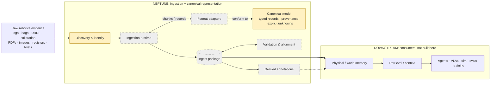

# Neptune: architecture at a glance

> This is the maintainer's mental model: under 2 minutes to read, updated after every PR that changes the
> architecture. Engineering detail is in `docs/architecture.md` and `docs/adr/`.

## 1. In one sentence

Neptune turns messy robotics evidence (logs, bags, robot descriptions, calibration, documents, images, site
records) into one canonical, fully traceable representation. Memory, retrieval and training systems use it
without ever re-parsing raw data.

## 2. Architecture

Green = built · amber = partial · grey dashed = not built. Nothing is fully green yet. The downstream boxes are
other systems.

## 3. Components

| Box | Does | In → Out |
|---|---|---|
| Discovery & identity | Finds files and identifies each one by its bytes. Tracks renames, changes and deletions without rewriting history | folders (object stores later) → identified sources |
| Ingestion runtime | Plans the work in chunks and runs them in isolation. Owns resume, caching, sandboxing and partial failure | identified sources → records written to the package |
| Format adapters | One per format (MCAP, ROS, PX4, URDF, PDF, CSV…). Decodes bytes into records and reports problems as findings, never crashes | a chunk of bytes → canonical records + findings |
| Canonical model | The shared vocabulary every adapter must emit: typed records, time in declared clocks, units as declared, frames, versions, provenance, explicit unknowns | n/a (it is the contract) |
| Ingest package | The output on disk: records, time-series, raw bytes and a receipt | records → a portable, deterministic package |
| Validation & alignment | Cross-source checks, and linking clocks, frames and identities across sources. Adds new records and never edits old ones | the package → findings + alignment records |
| Derived annotations | Anything inferred by models or heuristics (captions, "this topic is an IMU"), kept apart from evidence | evidence records → inferred records |
| Downstream | Memory, retrieval, agents, evals. Not part of Neptune | the package → their own stores |

## 4. Core data flow

1. Evidence arrives as a folder today, and later as an object store or a live stream.
2. Every file is fingerprinted and identified by its bytes. Nothing is ever modified.
3. Adapters recognise their files and plan the work in chunks.
4. The runtime runs each chunk. Adapters decode it into canonical records, and each value carries where it came
   from and what is unknown. A corrupt file produces findings, not a failed job.
5. Records, time-series and raw bytes are written to the ingest package, with a receipt.
6. Validation and alignment add cross-source findings and links as new records.
7. Downstream systems read the package and never touch the raw data again.

## 5. Boundaries that matter

- **Package → downstream.** The ingest package is Neptune's only product surface. Memory and retrieval are
  consumers, not features.
- **Runtime ↔ adapters.** A small fixed contract: adapters are pure, cannot touch disk or network, and can run
  sandboxed. Dozens of adapters stay simple because the runtime owns everything else.
- **Canonical model.** The contract between every adapter and every consumer. It is frozen after M1, and
  changes need a written decision (ADR).
- **Evidence → derived.** A one-way arrow. Inferred content points at evidence and never the reverse, so models
  can be re-run without touching evidence.
- **Source interface.** Local disk today. Object stores and streams plug in without changing adapters.

## 6. Current state

**BUILT**
- Source identity for local folders: content-addressed files, plus revision and deletion history that is never
  rewritten. Symlinks and hostile paths are handled safely.

**PARTIAL**
- Canonical model. Built: explicit unknown states, timestamps and clock domains, declared units with exact SI
  conversion, coordinate frames and transforms, software/firmware/model versions, and provenance. Provenance
  cites exact source bytes plus the transform chain, and survives parser upgrades. Still to come: the entity
  types (Run, Stream, Machine, Site, …).
- Discovery. Files are walked and fingerprinted. Format detection and run grouping are not built.

**NOT BUILT**
- Ingestion runtime (chunking, resume, cache, sandbox)
- Every format adapter
- Ingest package writer and receipt
- Validation and cross-source alignment
- Derived annotations
- CLI / Python SDK
- Connectors and streaming (object stores, live ingest)

## 7. Decisions that are expensive to reverse

| Decision | Why |
|---|---|
| Neptune builds ingestion + canonical representation only | Keeps it from becoming "RAG for MCAP" and gives downstream one clean input |
| Raw bytes are immutable; output is deterministic | Any result can be regenerated and checked byte for byte |
| Three kinds of identity: bytes, records (per parser version), real things (declared only) | Renames and parser upgrades never break joins, and two identical URDFs are still two robots |
| Every value carries its own provenance (source bytes, exact location, transform chain) | Any value is explainable without a separate index |
| Six explicit "unknown" states instead of null | A blank cell can never silently become a fact |
| Time, units and frames are stored as declared; conversions are traceable derivatives | No silent UTC, SI or frame assumptions |
| Evidence and inference are separate layers | Models can be swapped or re-run without contaminating evidence |
| Output is a file package (JSON Lines + Parquet + content-addressed blobs) | Portable, diffable, no database to operate |
| Four-method adapter contract; the runtime owns resume, cache and validation | Many adapters, written in parallel, stay small and uniform |
