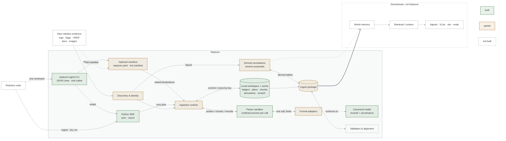

# Neptune architecture

```mermaid
flowchart LR
  RAW["Raw robotics evidence<br/>logs · bags · URDF<br/>docs · images"]
  DEV["Robotics code"]

  subgraph N["Neptune"]
    CLI["neptune ingest CLI<br/>JSON Lines · exit codes"]
    SDK["Python SDK<br/>sync · async"]
    DISC["Discovery &amp; identity"]
    RT["Ingestion runtime"]
    WS[("Local workspace + cache<br/>ledgers · plans · chunks<br/>derivatives · scratch")]
    AD["Format adapters"]
    SB["Parser sandbox<br/>confined process per call"]
    CAN["Canonical model<br/>records + provenance"]
    PKG[("Ingest package")]
    VAL["Validation &amp; alignment"]
    DER["Derived annotations<br/>session proposals"]
    MAN["Optional manifest<br/>neptune.yaml · init-manifest"]
  end

  subgraph D["Downstream, not Neptune"]
    MEM["World memory"]
    RET["Retrieval / context"]
    USE["Agents · VLAs · sim · evals"]
  end

  RAW --> DISC --> RT
  DEV -->|ingest · dry run| SDK -->|runs jobs| RT
  DEV -->|one command| CLI -->|wraps| SDK
  RT <-->|probes / chunks / records| SB
  SB <-->|one call, limits| AD
  AD -.->|conforms to| CAN
  RT <-->|commit / reuse by key| WS
  WS --> PKG
  PKG <--> VAL
  DISC -->|layout| DER
  RAW -.->|neptune.yaml| MAN
  CLI -->|init-manifest| MAN
  MAN -->|stated declarations| RT
  DER <-->|derived tables| PKG
  PKG ==> MEM --> RET --> USE
  DER -.-> MEM

  subgraph KEY[" "]
    K1["built"]
    K2["partial"]
    K3["not built"]
  end
  USE ~~~ K1 & K2 & K3

  classDef built fill:#6a9f7426,stroke:#6a9f74,stroke-width:2px
  classDef partial fill:#c09a5b26,stroke:#c09a5b,stroke-width:2px
  classDef todo fill:none,stroke:#8b949e,stroke-width:1.5px,stroke-dasharray:5 4
  classDef ext fill:none,stroke:#8b949e,stroke-width:1px
  class CAN,WS,K1 built
  class DISC,RT,AD,PKG,DER,MAN,K2 partial
  class VAL,K3 todo
  class SB built
  class SDK,CLI built
  class DEV ext
  class RAW,MEM,RET,USE ext
  style N fill:#8b949e0f,stroke:#8b949e
  style D fill:none,stroke:#8b949e,stroke-dasharray:2 3
  style KEY fill:none,stroke:none
  linkStyle default stroke:#8b949e
```
