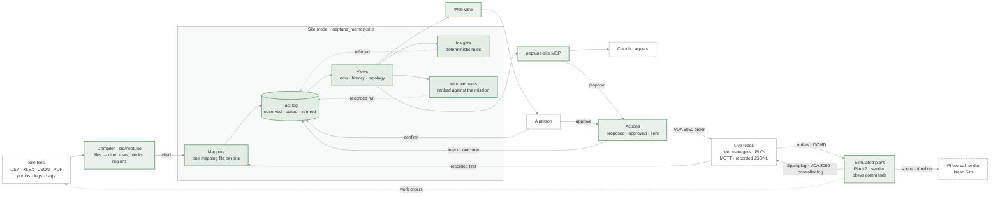

# Neptune architecture

```mermaid
flowchart LR
  FILES["Site files<br/>CSV · XLSX · JSON · PDF<br/>photos · logs · bags"]
  FEED["Live feeds<br/>fleet managers · PLCs<br/>MQTT · recorded JSONL"]
  USE["Claude · agents"]
  PERSON["A person"]
  SIM["Simulated plant<br/>Plant 7 · seeded<br/>obeys commands"]
  REN["Photoreal render<br/>Isaac Sim"]

  COMP["Compiler · src/neptune<br/>files → cited rows, blocks, regions"]

  subgraph S["Site model · neptune_memory.site"]
    MAP["Mappers<br/>one mapping file per site"]
    LOG[("Fact log<br/>observed · stated · inferred")]
    VIEWS["Views<br/>now · history · topology"]
    INS["Insights<br/>deterministic rules"]
    IMP["Improvements<br/>ranked against the mission"]
  end

  MCP["neptune-site MCP"]
  WEB["Web view"]
  ACT["Actions<br/>proposed · approved · sent"]

  FILES --> COMP -->|cited| MAP
  FEED -->|recorded first| MAP
  MAP --> LOG --> VIEWS --> INS
  INS -.->|inferred| LOG
  VIEWS --> IMP
  IMP -.->|recorded run| LOG
  VIEWS --> MCP --> USE
  VIEWS --> WEB --> PERSON
  PERSON -->|confirm| LOG
  MCP -->|propose| ACT
  PERSON -->|approve| ACT
  ACT -->|VDA 5050 order| FEED
  ACT -->|intent · outcome| LOG
  SIM -->|Sparkplug · VDA 5050 · controller log| FEED
  FEED -->|orders · DCMD| SIM
  SIM -.->|work orders| FILES
  SIM -->|scene · timeline| REN

  classDef built fill:#6a9f7426,stroke:#6a9f74,stroke-width:2px
  classDef todo fill:none,stroke:#8b949e,stroke-width:1.5px,stroke-dasharray:5 4
  classDef ext fill:none,stroke:#8b949e,stroke-width:1px
  class COMP,MAP,LOG,VIEWS,INS,IMP,MCP,WEB,ACT,SIM built
  class REN todo
  class FILES,FEED,USE,PERSON ext
  style S fill:#8b949e0f,stroke:#8b949e
  linkStyle default stroke:#8b949e
```
