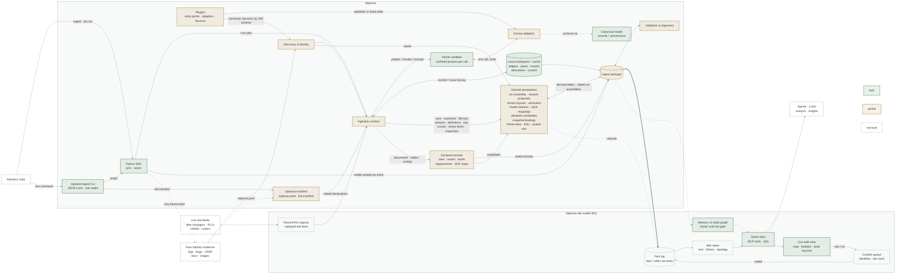

# Neptune architecture

```mermaid
flowchart LR
  RAW["Raw robotics evidence<br/>logs · bags · URDF<br/>docs · images"]
  DEV["Robotics code"]

  subgraph N["Neptune"]
    CLI["neptune ingest CLI<br/>JSON Lines · exit codes"]
    SDK["Python SDK<br/>sync · async"]
    DISC["Discovery &amp; identity"]
    RT["Ingestion runtime"]
    WS[("Local workspace + cache<br/>ledgers · plans · chunks<br/>derivatives · scratch")]
    AD["Format adapters"]
    PLG["Plugins<br/>entry points · adapters · Sources"]
    SB["Parser sandbox<br/>confined process per call"]
    CAN["Canonical model<br/>records + provenance"]
    PKG[("Ingest package")]
    VAL["Validation &amp; alignment"]
    DER["Derived annotations<br/>run assembly · session proposals<br/>stream layouts · semantics<br/>media streams · clock mappings<br/>declared candidates<br/>snapshot bindings<br/>frame trees · links · spatial refs"]
    DCL["Declared records<br/>sites · assets · briefs<br/>requirements · SOP steps"]
    MAN["Optional manifest<br/>neptune.yaml · init-manifest"]
  end

  FEED["Live site feeds<br/>fleet managers · PLCs<br/>CMMS · rosters"]
  subgraph S["Neptune site model (M1)"]
    CAPT["Record-first capture<br/>replayed site feed"]
    LOG[("Fact log<br/>seq = when we knew")]
    CONF["Confirm queue<br/>identities · doc facts"]
    VIEWS["Site views<br/>now · history · topology"]
    V2["Memory v2 claim graph<br/>frozen until the gate"]
    QRY["Query layer<br/>MCP tools · SQL"]
    WEB["Live web view<br/>map · timeline · cited sources"]
  end
  USE["Agents · LLMs<br/>analysis · insights"]

  RAW --> DISC --> RT
  DEV -->|ingest · dry run| SDK -->|runs jobs| RT
  DEV -->|one command| CLI -->|wraps| SDK
  RT <-->|probes / chunks / records| SB
  SB <-->|one call, limits| AD
  PLG -->|admitted, in fixed order| AD
  PLG -->|connector Sources, by URI scheme| DISC
  AD -.->|conforms to| CAN
  RT <-->|commit / reuse by key| WS
  WS --> PKG
  PKG <--> VAL
  DISC -->|layout| DER
  RT -->|runs · machines · file lists<br/>streams · definitions · row counts · series times · snapshots| DER
  SDK -->|media window by clock| PKG
  SDK -.->|lazy frame bytes| RAW
  RT -->|documents · tables · configs| DCL
  DCL -->|stated records| PKG
  DCL -->|candidates| DER
  RAW -.->|neptune.yaml| MAN
  CLI -->|init-manifest| MAN
  MAN -->|stated declarations| RT
  DER <-->|derived tables · stated run assemblies| PKG
  FEED --> CAPT --> RT
  PKG ==> LOG
  DER -.->|inferred| LOG
  CONF -->|stated| LOG
  LOG --> VIEWS --> QRY --> USE
  QRY --> WEB
  WEB -->|yes / no| CONF
  PKG -.-> V2 -.-> QRY

  subgraph KEY[" "]
    K1["built"]
    K2["partial"]
    K3["not built"]
  end
  USE ~~~ K1 & K2 & K3

  classDef built fill:#6a9f7426,stroke:#6a9f74,stroke-width:2px
  classDef partial fill:#c09a5b26,stroke:#c09a5b,stroke-width:2px
  classDef todo fill:none,stroke:#8b949e,stroke-width:1.5px,stroke-dasharray:5 4
  classDef ext fill:none,stroke:#8b949e,stroke-width:1px
  class CAN,WS,K1 built
  class DISC,RT,AD,PKG,DER,MAN,VAL,PLG,DCL,K2 partial
  class K3 todo
  class SB built
  class SDK,CLI built
  class DEV ext
  class RAW,FEED,USE ext
  class CAPT,LOG,CONF,VIEWS todo
  class V2,QRY,WEB built
  style N fill:#8b949e0f,stroke:#8b949e
  style S fill:#8b949e0f,stroke:#8b949e
  style KEY fill:none,stroke:none
  linkStyle default stroke:#8b949e
```
