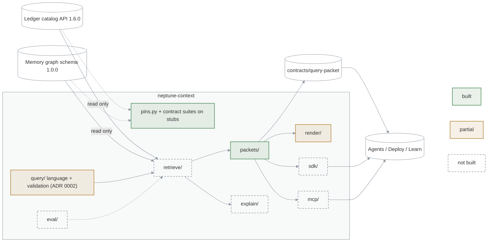

# neptune-context architecture

```mermaid
flowchart LR
  LED[("Ledger catalog API 1.6.0")]
  MEM[("Memory graph schema 1.0.0")]
  subgraph P["neptune-context"]
    PIN["pins.py + contract suites on stubs"]
    QRY["query/ language + validation (ADR 0002)"]
    RET["retrieve/"]
    PKT["packets/"]
    RND["render/"]
    SDK["sdk/"]
    MCP["mcp/"]
    EXP["explain/"]
    EVA["eval/"]
  end
  OUT[("Agents / Deploy / Learn")]
  CON[("contracts/query-packet")]
  LED -->|read only| RET
  MEM -->|read only| RET
  LED & MEM -.-> PIN
  QRY --> RET --> PKT --> RND
  RET --> EXP
  PKT --> SDK & MCP
  EVA -.-> RET
  PKT --> CON --> OUT
  SDK & MCP --> OUT

  subgraph KEY[" "]
    K1["built"]
    K2["partial"]
    K3["not built"]
  end
  OUT ~~~ K1 & K2 & K3

  classDef built fill:#6a9f7426,stroke:#6a9f74,stroke-width:2px
  classDef partial fill:#c09a5b26,stroke:#c09a5b,stroke-width:2px
  classDef todo fill:none,stroke:#8b949e,stroke-width:1.5px,stroke-dasharray:5 4
  classDef ext fill:none,stroke:#8b949e,stroke-width:1px
  class K1,PIN,PKT built
  class K2,QRY,RND partial
  class RET,SDK,MCP,EXP,EVA,K3 todo
  class LED,MEM,OUT,CON ext
  style P fill:#8b949e0f,stroke:#8b949e
  style KEY fill:none,stroke:none
  linkStyle default stroke:#8b949e
```
