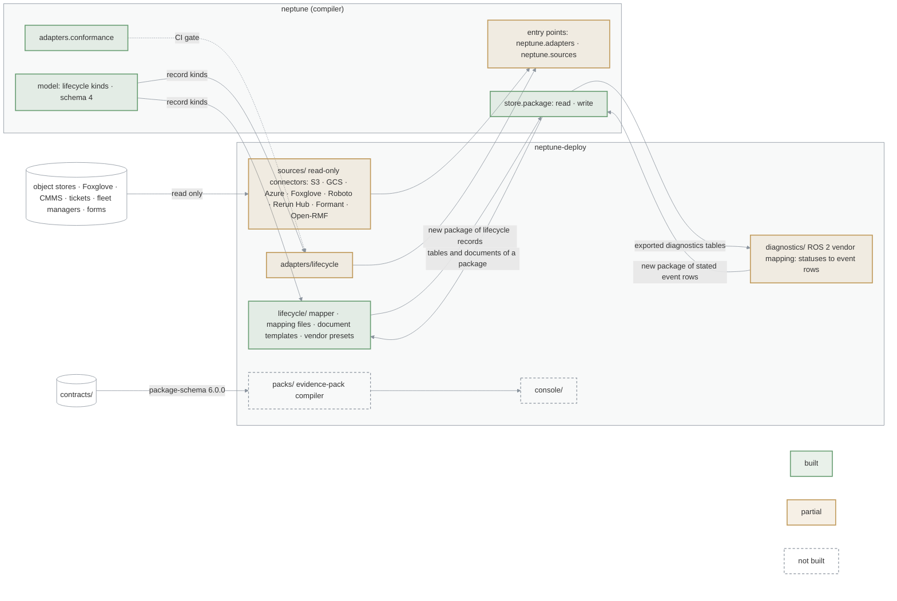

# neptune-deploy architecture

```mermaid
flowchart LR
  EXT[("object stores · Foxglove · CMMS · tickets · fleet managers · forms")]
  subgraph P["neptune-deploy"]
    SRC["sources/ read-only connectors: S3 · GCS · Azure · Foxglove · Roboto · Rerun Hub · Formant · Open-RMF"]
    LIF["adapters/lifecycle"]
    MAP["lifecycle/ mapper · mapping files · document templates · vendor presets"]
    DIAG["diagnostics/ ROS 2 vendor mapping: statuses to event rows"]
    PACKS["packs/ evidence-pack compiler"]
    CONSOLE["console/"]
  end
  subgraph C["neptune (compiler)"]
    EP["entry points: neptune.adapters · neptune.sources"]
    CONF["adapters.conformance"]
    MODEL["model: lifecycle kinds · schema 4"]
    STORE["store.package: read · write"]
  end
  CON[("contracts/")]

  EXT -->|read only| SRC
  SRC --> EP
  LIF --> EP
  CONF -.->|CI gate| LIF
  MODEL -->|record kinds| LIF
  STORE -->|tables and documents of a package| MAP
  MAP -->|new package of lifecycle records| STORE
  MODEL -->|record kinds| MAP
  STORE -->|exported diagnostics tables| DIAG
  DIAG -->|new package of stated event rows| STORE
  CON -->|package-schema 6.0.0| PACKS
  PACKS --> CONSOLE

  subgraph KEY[" "]
    K1["built"]
    K2["partial"]
    K3["not built"]
  end
  CONSOLE ~~~ K1 & K2 & K3

  classDef built fill:#6a9f7426,stroke:#6a9f74,stroke-width:2px
  classDef partial fill:#c09a5b26,stroke:#c09a5b,stroke-width:2px
  classDef todo fill:none,stroke:#8b949e,stroke-width:1.5px,stroke-dasharray:5 4
  classDef ext fill:none,stroke:#8b949e,stroke-width:1px
  class K1,CONF,MODEL,STORE,MAP built
  class K2,LIF,EP,SRC,DIAG partial
  class PACKS,CONSOLE,K3 todo
  class CON,EXT ext
  style P fill:#8b949e0f,stroke:#8b949e
  style C fill:#8b949e0f,stroke:#8b949e
  style KEY fill:none,stroke:none
  linkStyle default stroke:#8b949e
```
