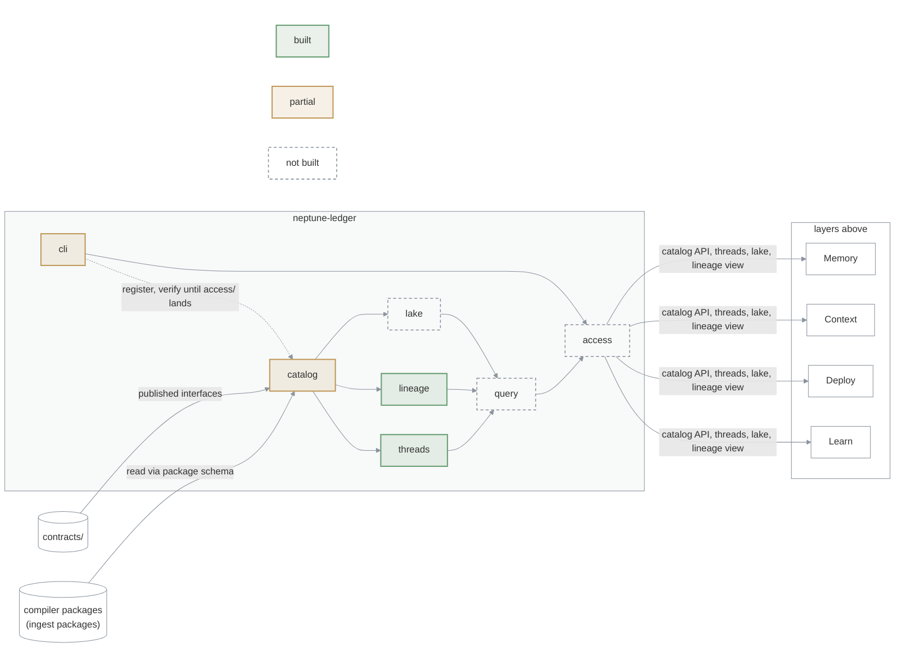

# neptune-ledger architecture

```mermaid
flowchart LR
  PKG[("compiler packages<br/>(ingest packages)")]
  CON[("contracts/")]

  subgraph L["neptune-ledger"]
    CAT["catalog"]
    THR["threads"]
    LIN["lineage"]
    LAKE["lake"]
    QRY["query"]
    ACC["access"]
    CLI["cli"]
  end

  subgraph UP["layers above"]
    MEM["Memory"]
    CTX["Context"]
    DEP["Deploy"]
    LRN["Learn"]
  end

  PKG -->|read via package schema| CAT
  CON -->|published interfaces| CAT
  CAT --> THR
  CAT --> LIN
  CAT --> LAKE
  THR --> QRY
  LIN --> QRY
  LAKE --> QRY
  QRY --> ACC
  ACC -->|catalog API, threads, lake, lineage view| MEM & CTX & DEP & LRN
  CLI --> ACC
  CLI -.->|register, verify until access/ lands| CAT

  subgraph KEY[" "]
    K1["built"]
    K2["partial"]
    K3["not built"]
  end
  CLI ~~~ K1 & K2 & K3

  classDef built fill:#6a9f7426,stroke:#6a9f74,stroke-width:2px
  classDef partial fill:#c09a5b26,stroke:#c09a5b,stroke-width:2px
  classDef todo fill:none,stroke:#8b949e,stroke-width:1.5px,stroke-dasharray:5 4
  classDef ext fill:none,stroke:#8b949e,stroke-width:1px
  class THR,LIN,K1 built
  class CAT,CLI,K2 partial
  class LAKE,QRY,ACC,K3 todo
  class PKG,CON,MEM,CTX,DEP,LRN ext
  style L fill:#8b949e0f,stroke:#8b949e
  style UP fill:none,stroke:#8b949e
  style KEY fill:none,stroke:none
  linkStyle default stroke:#8b949e
```
