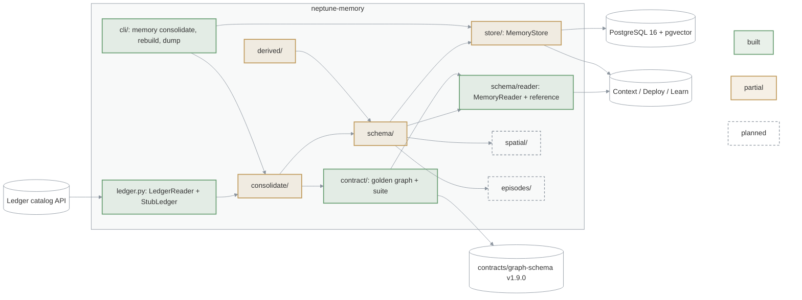

# neptune-memory architecture

```mermaid
flowchart LR
  LED[("Ledger catalog API")]
  PG[("PostgreSQL 16 + pgvector")]
  subgraph M["neptune-memory"]
    SEAM["ledger.py: LedgerReader + StubLedger"]
    CON["consolidate/"]
    DER["derived/"]
    SCH["schema/"]
    RD["schema/reader: MemoryReader + reference"]
    CT["contract/: golden graph + suite"]
    STO["store/: MemoryStore"]
    SPA["spatial/"]
    EPI["episodes/"]
    CLI["cli/: memory consolidate, rebuild, dump"]
  end
  OUT[("Context / Deploy / Learn")]
  LED --> SEAM --> CON --> SCH --> STO
  DER --> SCH
  SCH --> SPA & EPI
  SCH --> RD --> OUT
  CON --> CT --> RD
  CT --> REG[("contracts/graph-schema v1.9.0")]
  STO --> OUT
  CLI --> CON
  CLI --> STO
  STO --> PG

  subgraph KEY[" "]
    K1["built"]
    K2["partial"]
    K3["planned"]
  end
  OUT ~~~ K1 & K2 & K3

  classDef built fill:#6a9f7426,stroke:#6a9f74,stroke-width:2px
  classDef partial fill:#c09a5b26,stroke:#c09a5b,stroke-width:2px
  classDef todo fill:none,stroke:#8b949e,stroke-width:1.5px,stroke-dasharray:5 4
  classDef ext fill:none,stroke:#8b949e,stroke-width:1px
  class K1 built
  class K2 partial
  class SPA,EPI,K3 todo
  class CON,DER,SCH,STO partial
  class SEAM,RD,CT,CLI built
  class LED,OUT,PG,REG ext
  style M fill:#8b949e0f,stroke:#8b949e
  style KEY fill:none,stroke:none
  linkStyle default stroke:#8b949e
```
