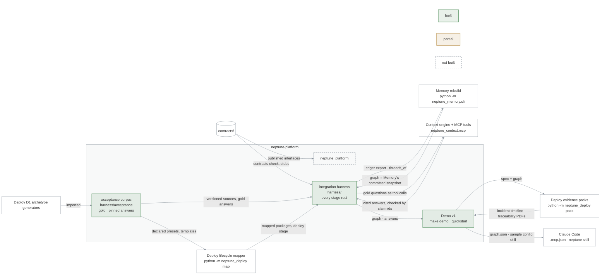

# neptune-platform architecture

```mermaid
flowchart LR
  subgraph P["neptune-platform"]
    CORE["neptune_platform"]
    CORPUS["acceptance corpus<br/>harness/acceptance<br/>gold · pinned answers"]
    HARNESS["integration harness<br/>harness/<br/>every stage real"]
    DEMO["Demo v1<br/>make demo · quickstart"]
  end
  CON[("contracts/")]
  D1["Deploy D1 archetype generators"]
  DM["Deploy lifecycle mapper<br/>python -m neptune_deploy map"]
  MEM["Memory rebuild<br/>python -m neptune_memory.cli"]
  CTX["Context engine + MCP tools<br/>neptune_context.mcp"]
  PACKS["Deploy evidence packs<br/>python -m neptune_deploy pack"]
  CC["Claude Code<br/>.mcp.json · neptune skill"]
  CON -->|published interfaces| CORE
  CON -->|contracts check, stubs| HARNESS
  D1 -->|imported| CORPUS
  CORPUS -->|versioned sources, gold answers| HARNESS
  CORPUS -->|declared presets, templates| DM
  DM -->|mapped packages, deploy stage| HARNESS
  HARNESS -->|Ledger export · threads_of| MEM
  MEM -->|graph = Memory's committed snapshot| HARNESS
  HARNESS -->|gold questions as tool calls| CTX
  CTX -->|cited answers, checked by claim ids| HARNESS
  HARNESS -->|graph · answers| DEMO
  DEMO -->|spec + graph| PACKS
  PACKS -->|incident timeline · traceability PDFs| DEMO
  DEMO -->|graph.json · sample config · skill| CC

  subgraph KEY[" "]
    K1["built"]
    K2["partial"]
    K3["not built"]
  end
  CORE ~~~ K1 & K2 & K3

  classDef built fill:#6a9f7426,stroke:#6a9f74,stroke-width:2px
  classDef partial fill:#c09a5b26,stroke:#c09a5b,stroke-width:2px
  classDef todo fill:none,stroke:#8b949e,stroke-width:1.5px,stroke-dasharray:5 4
  classDef ext fill:none,stroke:#8b949e,stroke-width:1px
  class K1,CORPUS,HARNESS,DEMO built
  class K2 partial
  class CORE,K3 todo
  class CON,D1,DM,MEM,CTX,PACKS,CC ext
  style P fill:#8b949e0f,stroke:#8b949e
  style KEY fill:none,stroke:none
  linkStyle default stroke:#8b949e
```
